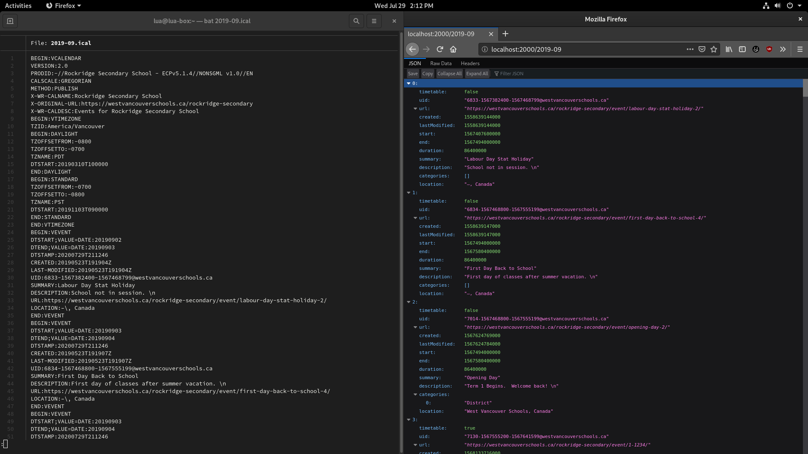

# RockBlock CalendarServer
Downloads and parses iCalendar data from the web (ex. [https://westvancouverschools.ca/rockridge-secondary/events](https://westvancouverschools.ca/rockridge-secondary/events)) and then serves the parsed data as JSON via HTTP.

Example of JSON transformation using real-world data:


## Installation
First, ensure you have the Java 11 JRE (or newer):
```
$ java --version
openjdk 11.0.8 2020-07-14
OpenJDK Runtime Environment 18.9 (build 11.0.8+10)
OpenJDK 64-Bit Server VM 18.9 (build 11.0.8+10, mixed mode, sharing)
```

Then head over to the [Releases](https://github.com/luawtf/rockblock-calendarserver/releases) page and download the latest JAR file.

Finally, execute the .JAR:
```
$ java -jar calendarserver-1.0.jar
[main] INFO wtf.lua.rockblock.calendarserver.App - Starting CalendarServer...
[main] INFO org.eclipse.jetty.util.log - Logging initialized @426ms to org.eclipse.jetty.util.log.Slf4jLog
[main] INFO io.javalin.Javalin - Starting Javalin ...
[main] INFO io.javalin.Javalin - Listening on http://localhost:2000/
[main] INFO io.javalin.Javalin - Javalin started in 102ms \o/
```

## Usage
When starting the CalendarServer, many options are available:
```
$ java -jar calendarserver-1.0.jar --help
usage: calendarserver
Downloads and parses iCalendar data from the web and then serves the
parsed data as JSON via HTTP
 -h,--help                       display program help page
 -v,--version                    display program version
 -p,--api-port <arg>             port number to listen on
 -c,--api-cache <arg>            api cache time-to-live (ms)
 -d,--calculate-duration <arg>   automatically fill in duration field of
                                 events
 -r,--timetable-regex <arg>      regex that matches timetable events (can
                                 be blank)
 -t,--download-timeout <arg>     timeout before retrying a download (ms)
 -u,--template-url <arg>         template URL for downloading iCalendar
                                 data
 -a,--template-agent <arg>       template for the UserAgent header
calendarserver v1.0
```

These options are merged into the defaults found in [Config.java](./src/main/java/wtf/lua/rockblock/calendarserver/Config.java#L56):
```java
/** Port number to listen on */
public int apiPort = 2000;
/** API cache time-to-live (in milliseconds) */
public long apiCacheTTL = 3600000; // 30 minutes

/** Automatically fill in Event.duration? */
public boolean interpretCalculateDuration = true;
/** Regular expression used for matching and flagging events as timetable events (leave empty for no flagging) */
public String interpretTimetableRegex = "[12](\\s*-\\s*|\\s+)[1234]{4}[xX]?";

/** Timeout before retrying a download */
public long downloadTimeout = 30000; // 30 seconds

/** URL template to download iCalendar files from, '$' will be replaced with the requested month (ex "2020-12") */
public String templateURL = "https://westvancouverschools.ca/rockridge-secondary/events/$/?ical=1";
/** UserAgent template, sent as the User-Agent header when downloading iCalendar files, '$' will be replaced with the current CalendarServer version */
public String templateUserAgent = "RockBlock-CalendarServer/$ (https://github.com/luawtf/rockblock-calendarserver)";
```

## API
Once you're up-and-running, you can access event data from your iCalendar source at:
```
http://<address>:<port>/YYYY-MM
```
The CalendarServer will then return an array of Events from that calendar.
If the request fails, a `text/plain` error message will be sent instead (with a non-2XX status).

Event JSON objects will always satisfy the following TypeScript interface:
```typescript
/** Event represents a calendar event */
export interface Event {
	/** Has this event been flagged as being part of the timetable? */
	timetable: boolean;

	/** Unique event identifier */
	uid: string | null;
	/** URL pointing to this event's origin */
	url: string | null;

	/** Creation timestamp (milliseconds since 1970) */
	created: number | null;
	/** Last modified timestamp (milliseconds since 1970) */
	lastModified: number | null;

	/** Event start timestamp (milliseconds since 1970) */
	start: number | null;
	/** Event end timestamp (milliseconds since 1970) */
	end: number | null;
	/** Event duration (milliseconds) */
	duration: number | null;

	/** Short summary string */
	summary: string | null;
	/** Full description string */
	description: string | null;

	/** List of categories/tags given to this event */
	categories: string[];

	/** Location description string */
	location: string | null;
}
```

Here is a simple usage example that prints the summaries of all events:
```typescript
const calendar = (await fetch("http://localhost:2000/2019-09")).json() as Event[];

for (let i = 0; i < calendar.length; i++)
	console.log(`Event #${i}:`, calendar[i].summary ?? "unknown");
```

## Building
First, ensure you have the Java 11 JDK (or newer):
```
$ java --version
openjdk 11.0.8 2020-07-14
OpenJDK Runtime Environment 18.9 (build 11.0.8+10)
OpenJDK 64-Bit Server VM 18.9 (build 11.0.8+10, mixed mode, sharing)
$ javac --version
javac 11.0.8
```

Then, install [Apache Maven](https://maven.apache.org/):
```
$ mvn --version
Apache Maven 3.6.1 (Red Hat 3.6.1-5)
Maven home: /usr/share/maven
Java version: 11.0.8, vendor: Red Hat, Inc., runtime: /usr/lib/jvm/java-11-openjdk-11.0.8.10-2.fc32.x86_64
Default locale: en_CA, platform encoding: UTF-8
OS name: "linux", version: "5.7.8-200.fc32.x86_64", arch: "amd64", family: "unix"
```

Finally, clone and compile the repository:
```
$ git clone https://github.com/luawtf/rockblock-calendarserver
...
$ cd rockblock-calendarserver
$ mvn package
...
$ java -jar target/calendarserver-1.0.jar
[main] INFO wtf.lua.rockblock.calendarserver.App - Starting CalendarServer...
[main] INFO org.eclipse.jetty.util.log - Logging initialized @426ms to org.eclipse.jetty.util.log.Slf4jLog
[main] INFO io.javalin.Javalin - Starting Javalin ...
[main] INFO io.javalin.Javalin - Listening on http://localhost:2000/
[main] INFO io.javalin.Javalin - Javalin started in 102ms \o/
```

## Authors
Made with ❤ by Lua MacDougall ([lua.wtf](https://lua.wtf/))

## License
This project is licensed under [MIT](LICENSE).
More info in the [LICENSE](LICENSE) file.

*"A short, permissive software license. Basically, you can do whatever you want as long as you include the original copyright and license notice in any copy of the software/source. There are many variations of this license in use."* - [tl;drLegal](https://tldrlegal.com/license/mit-license)
